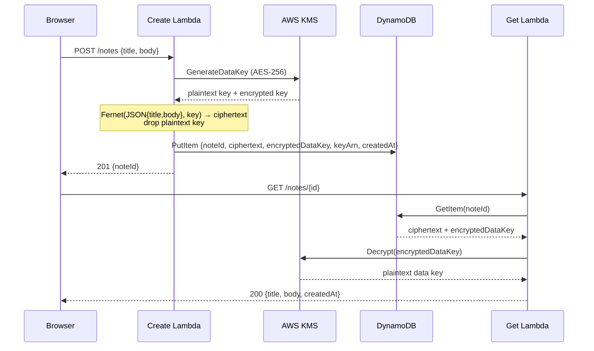

# Secure Notes App

A personal notes app where **every note is encrypted with its own AES-256 data key**, minted by AWS KMS. DynamoDB stores ciphertext only — a database leak reveals nothing without KMS access.

Static single-page frontend on S3 (optionally behind CloudFront + Origin Access Control) → HTTP API → two Python 3.12 Lambdas → DynamoDB, with a customer-managed KMS key and two least-privilege IAM roles.

## Architecture

```mermaid
flowchart LR
    U[User browser] -->|HTTPS| CF{S3 website\nor CloudFront + OAC}
    CF -->|GET /notes/{id}\nPOST /notes| API[HTTP API]
    API -->|POST /notes| FN1[Create Lambda]
    API -->|GET /notes/{id}| FN2[Get Lambda]
    FN1 -->|GenerateDataKey| KMS[(KMS customer key)]
    FN2 -->|Decrypt| KMS
    FN1 -->|PutItem ciphertext| DDB[(DynamoDB\nnoteId PK)]
    FN2 -->|GetItem| DDB
    FN1 -.->|logs: noteId only| CW[CloudWatch Logs]
    FN2 -.->|logs: noteId only| CW
```

## Data flow (envelope encryption)



### Why envelope encryption?

- KMS `Encrypt` caps plaintext at 4 KiB — envelope encryption handles notes of any size with one KMS call per note.
- Compromise of one data key exposes exactly one note, never the corpus.
- Rotating the KMS key only re-wraps data keys; existing ciphertext is untouched.
- See `src/common/crypto.py` for the implementation and a note on **data-key caching** (10-min TTL, AWS Encryption SDK style) as an interview talking point — deliberately *not* used here, because a personal notes app should default to one fresh key per note.

## Security model

| Component | Can do | Cannot do |
|---|---|---|
| Create Lambda role | `kms:GenerateDataKey` on the notes key; `dynamodb:PutItem` on the table | Decrypt anything, read the table, touch other keys |
| Get Lambda role | `kms:Decrypt` on the notes key; `dynamodb:GetItem` on the table | Mint data keys, write to the table |
| KMS key policy | Mirrors the above (both key policy *and* identity policy must allow) | No `kms:*` for either Lambda role; root retains admin |
| DynamoDB | Holds ciphertext + wrapped keys + metadata | Never sees plaintext — not even the title |
| CloudWatch Logs | noteId + byte counts | Plaintext bodies are never logged |
| S3 website bucket | Serves static assets | No secrets; `API_BASE` in `app.js` is just the public API URL |

## Deploy

Prerequisites: AWS CLI + SAM CLI, credentials configured.

```bash
sam build
sam deploy --guided   # answer prompts; note the ApiEndpoint output
```

Then point the frontend at your API and upload it:

```bash
# 1. paste the ApiEndpoint output into frontend/app.js (API_BASE constant)
# 2. upload the site (bucket name is in the WebsiteBucketName output)
aws s3 sync frontend/ s3://<WebsiteBucketName>/ --delete
```

To serve over HTTPS with a private bucket instead of the S3 website endpoint:

```bash
sam deploy --guided --parameter-overrides EnableCloudFront=true
```

Tear down: `sam delete`.

## Cost (free tier)

At personal-note scale this sits comfortably in the AWS Free Tier: Lambda 1M requests/mo, API Gateway 1M HTTP calls/mo, DynamoDB 25 GB on-demand, KMS 20k requests/mo, S3/CloudFront starter allowances. Expected bill: **$0**.

## Tests

```bash
python3 -m pytest tests/ -q
```

40 tests, all mocked (fake KMS + fake DynamoDB in `tests/conftest.py`) — no AWS credentials or network needed:

- `test_crypto.py` — encrypt/decrypt round-trips, per-note key uniqueness, tampered-ciphertext / wrong-key / forged-key failures, 100 KB body under DynamoDB limits.
- `test_handlers.py` — create→get flow, validation (400/413), 404s, decryption-failure 500s, and assertions that plaintext bodies never reach logs or storage.
- `test_template.py` — template parses; KMS key policy grants Lambdas only `GenerateDataKey`/`Decrypt`; no wildcard IAM actions; create role can't decrypt, get role can't mint.

## Project layout

```
template.yaml            # SAM: API, Lambdas, KMS, DynamoDB, S3 site (+ optional CloudFront/OAC)
src/
  requirements.txt       # cryptography, bundled by `sam build`
  common/crypto.py       # envelope-encryption helpers (+ data-key caching note)
  create_note/app.py     # POST /notes
  get_note/app.py        # GET /notes/{id}
frontend/
  index.html styles.css app.js   # dark single-page UI; set API_BASE after deploy
tests/
  conftest.py test_crypto.py test_handlers.py test_template.py
```

## Enhancement ideas

- Cognito user pools + per-user KMS grants (multi-tenant instead of personal).
- `GET /notes` list endpoint with server-side pagination (scan with title index).
- Data-key caching with 10-min TTL for high-throughput workloads.
- DynamoDB TTL for auto-expiring notes; S3 versioning for note history.
- WAF on the HTTP API + tightened CORS origin (currently `*` for demo simplicity).

## Portfolio deliverables checklist

- [ ] Screenshot: CloudFront/S3 URL serving the site
- [ ] Screenshot: API Gateway routes (`POST /notes`, `GET /notes/{id}`)
- [ ] Screenshot: DynamoDB item showing ciphertext + `encryptedDataKey` (no plaintext)
- [ ] Screenshot: create → get flow with CloudWatch logs (noteId only, no content)
- [ ] Short demo GIF: seal a note → open it with its ID
- [ ] GitHub repo with code + this README (architecture, encryption design, least-privilege policies, tests, costs)
- [ ] LinkedIn post one-liner + repo link
- [ ] Resume bullet: *"Built an envelope-encrypted notes app (KMS per-note data keys, Lambda, API Gateway, DynamoDB); zero plaintext at rest or in logs."*
