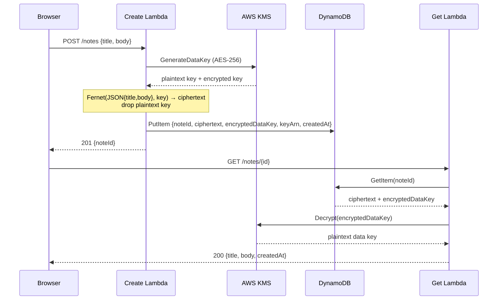

# Secure Notes App

A personal notes app where **every note is encrypted with its own AES-256 data key**, minted by AWS KMS. DynamoDB stores ciphertext only — a database leak reveals nothing without KMS access.

Static single-page frontend on S3 (optionally behind CloudFront + Origin Access Control) → HTTP API → three Python 3.12 Lambdas → DynamoDB, with a customer-managed KMS key and three least-privilege IAM roles.

**Features:** per-note envelope encryption · optional **tags** (plaintext metadata for search) with server-side `?q=` / `?tag=` filtering · optional **per-note expiry** via DynamoDB TTL · **notes export** script · dark single-page frontend with search + tag chips.

## Architecture



## Data flow (envelope encryption)



### Why envelope encryption?

- KMS `Encrypt` caps plaintext at 4 KiB — envelope encryption handles notes of any size with one KMS call per note.
- Compromise of one data key exposes exactly one note, never the corpus.
- Rotating the KMS key only re-wraps data keys; existing ciphertext is untouched.
- See `src/common/crypto.py` for the implementation and a note on **data-key caching** (10-min TTL, AWS Encryption SDK style) as an interview talking point — deliberately *not* used here, because a personal notes app should default to one fresh key per note.

## Security model

| Component | Can do | Cannot do |
|---|---|---|
| Create Lambda role | `kms:GenerateDataKey` on the notes key; `dynamodb:PutItem` on the table | Decrypt anything, read the table, touch other keys |
| Get Lambda role | `kms:Decrypt` on the notes key; `dynamodb:GetItem` on the table | Mint data keys, write to the table |
| List Lambda role | `dynamodb:Scan` on the table — metadata only | Any KMS operation: cannot mint or unwrap data keys, so note contents stay sealed even if compromised |
| KMS key policy | Mirrors the above (both key policy *and* identity policy must allow) | No `kms:*` for any Lambda role; root retains admin |
| DynamoDB | Holds ciphertext + wrapped keys + metadata (tags are plaintext by design, for search) | Never sees plaintext titles/bodies |
| DynamoDB TTL | Auto-deletes items whose numeric `expiresAt` has passed | — |
| CloudWatch Logs | noteId + byte counts | Plaintext bodies are never logged |
| S3 website bucket | Serves static assets | No secrets; `API_BASE` in `app.js` is just the public API URL |

### Design note: why tags are plaintext

`GET /notes` filters server-side without decrypting a single note — possible only because tags live outside the encrypted payload (DynamoDB String Set, like `createdAt`). The tradeoff is explicit: tags are searchable metadata, so never put secrets in them. Titles and bodies remain inside the envelope-encrypted payload, which is why full-text search is intentionally *not* offered — searching titles would require decrypting every note on the server.

## API

| Method | Path | Description |
|---|---|---|
| `POST` | `/notes` | Create a note. Body: `{"title", "body", "tags"? , "expiresAt"?}` → `201 {"noteId"}`. `tags`: ≤10 labels (lowercased, deduped). `expiresAt`: ISO-8601 or epoch seconds, must be in the future → DynamoDB TTL auto-deletes the note. |
| `GET` | `/notes` | List note **metadata** (never decrypts). Query: `?q=` substring over tags, `?tag=` exact tag, `?limit=` 1–100, `?nextToken=` pagination. → `{"notes": [{noteId, createdAt, tags, expiresAt, ciphertextBytes}], "count", "nextToken"}` |
| `GET` | `/notes/{id}` | Fetch + decrypt one note → `{noteId, title, body, createdAt, tags, expiresAt}` |

Export all notes (decrypted via the API) to JSON:

```bash
python3 scripts/export_notes.py --api-base https://<ApiEndpoint> [--tag finance] [--out notes.json]
```

The output contains plaintext bodies — keep the file private.

## Deploy

Prerequisites: AWS CLI + SAM CLI, credentials configured.

```bash
sam build
sam deploy --guided   # answer prompts; note the ApiEndpoint output
```

Then point the frontend at your API and upload it:

```bash
# 1. paste the ApiEndpoint output into frontend/app.js (API_BASE constant)
# 2. upload the site (bucket name is in the WebsiteBucketName output)
aws s3 sync frontend/ s3://<WebsiteBucketName>/ --delete
```

To serve over HTTPS with a private bucket instead of the S3 website endpoint:

```bash
sam deploy --guided --parameter-overrides EnableCloudFront=true
```

Tear down: `sam delete`.

## Cost (free tier)

At personal-note scale this sits comfortably in the AWS Free Tier: Lambda 1M requests/mo, API Gateway 1M HTTP calls/mo, DynamoDB 25 GB on-demand, KMS 20k requests/mo, S3/CloudFront starter allowances. Expected bill: **$0**.

## Tests

```bash
python3 -m pytest tests/ -q
```

87 tests, all mocked (fake KMS + fake DynamoDB in `tests/conftest.py`) — no AWS credentials or network needed:

- `test_crypto.py` — encrypt/decrypt round-trips, per-note key uniqueness, tampered-ciphertext / wrong-key / forged-key failures, 100 KB body under DynamoDB limits.
- `test_handlers.py` — create→get flow, validation (400/413), 404s, decryption-failure 500s, assertions that plaintext bodies never reach logs or storage; tag validation/normalization, expiry validation (ISO + epoch, future-only), tags/expiry round-trip through create→get.
- `test_list.py` — list returns metadata only (no ciphertext, no titles/bodies), tag=`?tag=` exact and `?q=` substring filtering, combined filters, newest-first ordering, limit/nextToken pagination, bad-param 400s, and proof the list path never calls KMS.
- `test_export.py` — export script pagination, per-note fetch, tag/q filter passthrough, error mapping, JSON output shape.
- `test_template.py` — template parses; KMS key policy grants Lambdas only `GenerateDataKey`/`Decrypt`; no wildcard IAM actions; create role can't decrypt, get role can't mint, list role has Scan only and zero KMS; key policy avoids the role circular dependency (`!Sub` ARNs, not `!GetAtt`); TTL enabled on `expiresAt`; all three API routes present; no hardcoded credentials.

CI (`.github/workflows/ci.yml`) runs the suite and `sam validate --lint` on every push to main and every PR.

## Project layout

```
template.yaml            # SAM: API, Lambdas, KMS, DynamoDB (+TTL), S3 site (+ optional CloudFront/OAC)
src/
  requirements.txt       # cryptography, bundled by `sam build`
  common/crypto.py       # envelope-encryption helpers (+ data-key caching note)
  create_note/app.py     # POST /notes (tags + optional TTL expiry)
  get_note/app.py        # GET /notes/{id}
  list_notes/app.py      # GET /notes — metadata-only search, never decrypts (no KMS perms)
scripts/
  export_notes.py        # export all notes (decrypted via API) to timestamped JSON
frontend/
  index.html styles.css app.js   # dark single-page UI: compose + open + browse/search; set API_BASE after deploy
tests/
  conftest.py test_crypto.py test_handlers.py test_list.py test_export.py test_template.py
.github/workflows/ci.yml # pytest + `sam validate --lint` on push/PR
```

## Enhancement ideas

- Cognito user pools + per-user KMS grants (multi-tenant instead of personal).
- Data-key caching with 10-min TTL for high-throughput workloads.
- S3 versioning for note history.
- WAF on the HTTP API + tightened CORS origin (currently `*` for demo simplicity).

